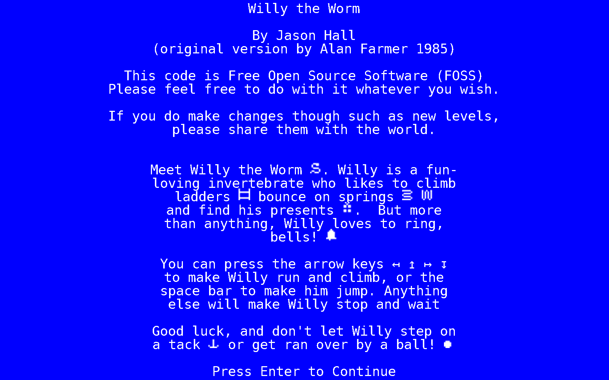
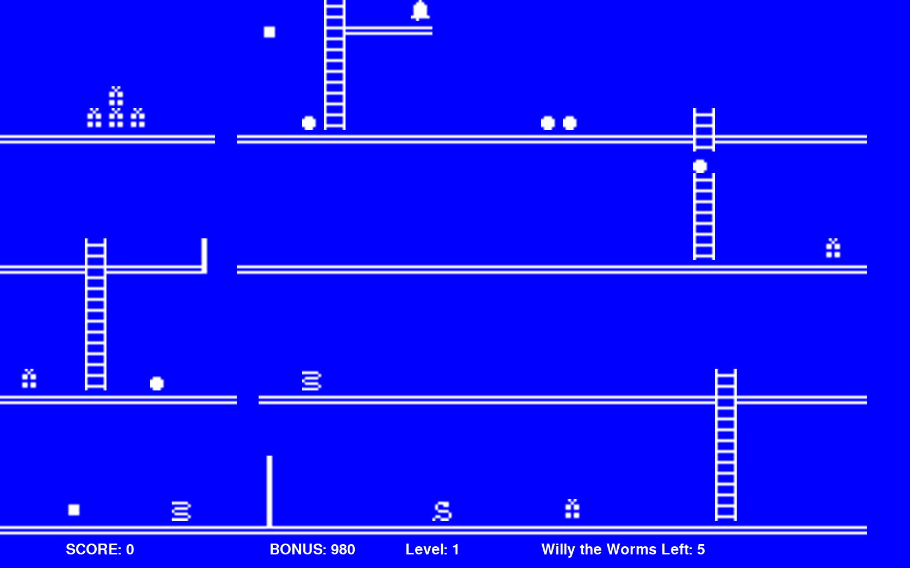

# willytheworm  (Willy the Worm clone)

Willy the Worm
by Jason Hall

Original Pascal Version by Alan Farmer

This code is Free Open Source Software (FOSS)
Please feel free to do with it whatever you wish.

If you do make changes though such as new levels
please share them with the world.

Meet Willy the Worm. Willy is a fun-loving invertebrate who likes to climb ladders, bounce on springs,
and find his presents.  But more than anything, Willy loves to ring bells!

You can press the arrow keys ↤ ↥ ↦ ↧ to make Willy run and climb, or the space bar to make him jump. Anything
else will make Willy stop and wait

Good luck, and don't let Willy step on a tack or get ran over by a ball!

F11 is set to change from full screen to window; F5, F6, and F7 will change screen colors.  
Spacebar jumps and arrow keys move.  WASD is supported via command line options. 
You can also turn off the flash at the command line.  

./willy.py 
	-l level  (change level)
	-b numberofballs   (change number of balls)
	-w useWASDkeyboard  (Use WASD instead of arrow keys)
	-f (Disables Flash) 
	-F framespersecond (Higher the number, the faster the game) 
	-m (Enables Mouse Support) 
	-h (HELP) 
	--help (help)

./edwiilly.py levelnumber (level you wish to edit; you can also press l to change levels)

	edwilly.py has these key bindings
	
	F11 -> Fullscreen/Window
	S -> Save
	L -> Next Level
	Left mouse button -> put object
	Scroll button -> Scroll through objects
	Right mouse button -> remove object
	P -> Play the current level (must save first; yes I consider this a bug)
	
A successful level must have a willy, two ball pits (the last one placed is where the balls come out so just delete it and add it to get it working), and a bell.  The rest are obstacles.  

A few differences from the original Willy the worm.
	No sound when falling.  In the original game, their was a small falling sound.  I don't have any sound.
	Audio is different.  Obviously using different sounds then the original.  All the sounds are replacable.  
	Flash is different.  I have a simple white flash.  I had the same flash as the original game but my wife has seizures so I thought a simple flash would be better.  She didn't like that so I added an option to disable the flash.

Running

pip install -r requirements.txt

./willy.py

or python -m pip install -r requirements.txt

./willy.py

or python3 -m pip install virtualenv; python -m virtualenv ~/python3/; source ~/python3/bin/activate; pip install -r requirements.txt       # Linux Instructions

Making distributable version.

pip install pyinstaller

**Willy keeps scores in the local directory because a temporary directory makes zero sense**

Linux:

	pyinstaller -F --add-binary "willy.chr:." --add-data "levels.json:." --add-binary "audio/*.mp3:audio/" willy.py

Windows:

	pyinstaller -F --add-binary "willy.chr;." --add-data "levels.json;." --add-binary "audio/*.mp3;audio/" willy.py

**EDWILLY Assumes you actually want to save the file levels.json and that must exist in the local directory**

Linux:

	pyinstaller -F --add-binary "willy.chr:." --add-binary "audio/*.mp3:audio/" edwilly.py

Windows:

	pyinstaller -F --add-binary "willy.chr;." --add-binary "audio/*.mp3;audio/" edwilly.py

This will create a directory named dist with willy.exe or edwilly.exe (or just willy or edwilly for UNIX like operating systems).  The directory "audio", file "willy.chr", "levels.json" (only for Willy), and audio files will be zipped up with the dist.  For edwilly, levels.json are not zipped up because it creates a temporary directory and any edits would disappear; defeating the purpose of an editor.  

# Compiling with nuitka

pip install nuitka
nuitka3 --follow-imports willy.py

-- Creates willy.bin

# Compiling edwilly

pip install nuitka
nuitka3 --follow-imports edwilly.py

-- Creates edwilly.bin

# Compiling as standalone

sudo yum install patchelf
nuitka3 --follow-imports --standalone --onefile willy.py
nuitka3 --follow-imports --standalone --onefile edwilly.py

# Compiling with Cython (not recommended since it doesn't compile dependencies)

pip install cython
cython --embed -o willy.c willy.py
gcc -Os -I /usr/include/python3.11 -o willy willy.c -lpython3.11 -lpthread -lm -lutil -ldl

cython --embed -o edwilly.c edwilly.py
gcc -Os -I /usr/include/python3.11 -o edwilly edwilly.c -lpython3.11 -lpthread -lm -lutil -ldl
